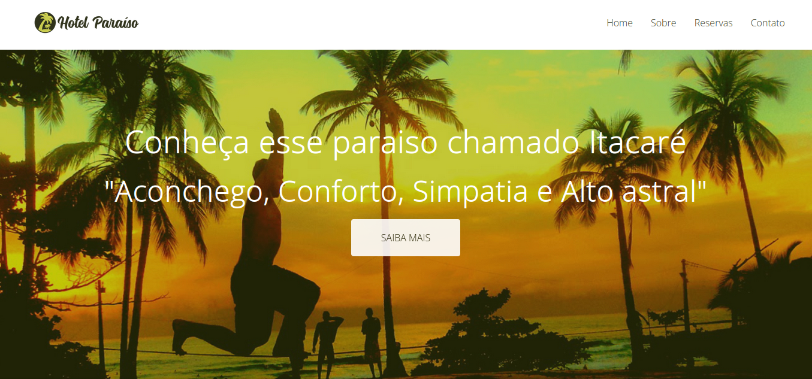
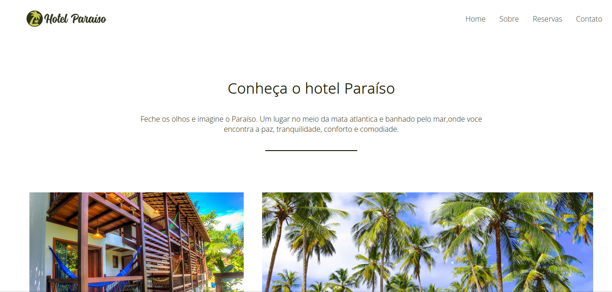
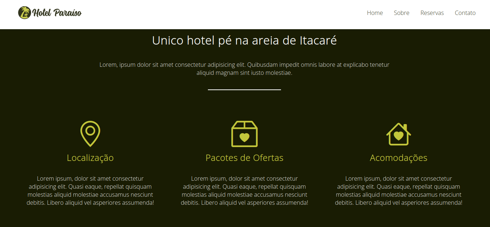
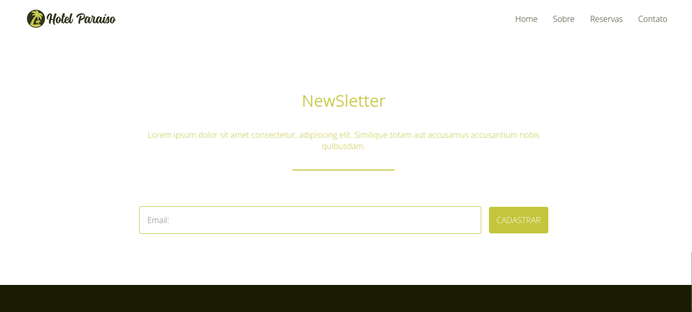

# hotel-paraiso
## Um simples site de um hotel com o nome "paraiso"... **SIMPLES**.

### Preview










### **HTML**

```
<!--

 █▀▀▄ █▀▀ ▀█░█▀ █▀▀▀█ █▀▀█ ▀▀█ ░▀░ █▀▀▄ █░░█ █▀▀█
 █░▒█ █▀▀ ░█▄█░ ▀▀▀▄▄ █░░█ ▄▀░ ▀█▀ █░░█ █▀▀█ █░░█
 █▄▄▀ ▀▀▀ ░░▀░░ █▄▄▄█ ▀▀▀▀ ▀▀▀ ▀▀▀ ▀░░▀ ▀░░▀ ▀▀▀▀

-->
<!DOCTYPE html>
<html lang="pt-BR">
<head>
    <meta charset="UTF-8">
    <meta name="viewport" content="width=device-width, initial-scale=1.0">
    <title>Hoteç Paraíso</title>
    <link rel="stylesheet" href="css/style.css">
    <link rel="preconnect" href="https://fonts.googleapis.com">
    <link rel="preconnect" href="https://fonts.gstatic.com" crossorigin>
    <link href="https://fonts.googleapis.com/css2?family=Open+Sans:wght@300&display=swap" rel="stylesheet">
    <link rel="stylesheet" href="https://cdn.jsdelivr.net/npm/bootstrap-icons@1.10.5/font/bootstrap-icons.css">
</head>
<body>
    <header>
        <a href="#"></a>

        <nav>
            <li><a href="#">Home</a></li>
            <li><a href="#sb">Sobre</a></li>
            <li><a href="#rv">Reservas</a></li>
            <li><a href="#ctt">Contato</a></li>
        </nav>
    </header>

    <section class="hero">
        <h1>Conheça esse paraiso chamado Itacaré</h1>
        <h3>"Aconchego, Conforto, Simpatia e Alto astral"</h3>
        <a href="#" class="btn">Saiba Mais</a>
    </section>
    <section class="conheca-o-hotel" id="sb">
        <h3>Conheça o hotel Paraíso</h3>
        <p>Feche os olhos e imagine o Paraíso. Um lugar no meio da mata atlantica e banhado pelo mar,onde voce encontra a paz, tranquilidade, conforto e comodiade.</p>
        <hr>
        <ul class="grid">
            <li class="small" style="background-image: url(img/itacare-01.jpg);"></li>
            <li class="large" style="background-image: url(img/itacare-02.jpg);"></li>
            <li class="large" style="background-image: url(img/itacare-03.jpg);"></li>
            <li class="small" style="background-image: url(img/itarace-04.jpg);"></li>
        </ul>
    </section>
    <section class="caracteristicas" id="rv">
        <h3>Unico hotel pé na areia de Itacaré</h3>
        <p>Lorem, ipsum dolor sit amet consectetur adipisicing elit. Quibusdam impedit omnis labore at explicabo tenetur aliquid magnam sint iusto molestiae.</p>
        <hr>
        <ul class="grid">
            <li>
                <i class="bi bi-geo-alt"></i>
                <h4>Localização</h4>
                <p>Lorem ipsum, dolor sit amet consectetur adipisicing elit. Quasi eaque, repellat quisquam molestias aliquid molestiae accusamus nesciunt debitis. Libero aliquid vel asperiores assumenda!</p>
            </li>
            <li>
                <i class="bi bi-box2-heart"></i>
                <h4>Pacotes de Ofertas</h4>
                <p>Lorem ipsum, dolor sit amet consectetur adipisicing elit. Quasi eaque, repellat quisquam molestias aliquid molestiae accusamus nesciunt debitis. Libero aliquid vel asperiores assumenda!</p>
            </li>
            <li>
                <i class="bi bi-house-heart"></i>
                <h4>Acomodações</h4>
                <p>Lorem ipsum, dolor sit amet consectetur adipisicing elit. Quasi eaque, repellat quisquam molestias aliquid molestiae accusamus nesciunt debitis. Libero aliquid vel asperiores assumenda!</p>
            </li>
        </ul>
    </section>
    <section class="newsletter" id="ctt">
        <h3>NewSletter</h3>
        <p>Lorem ipsum dolor sit amet consectetur, adipisicing elit. Similique totam aut accusamus accusantium nobis quibusdam.</p>
        <hr>
        <form>
            <input type="text" placeholder="Email:">
            <button>Cadastrar</button>
        </form>
    </section>
    <footer>
        <ul>
            <li>
                <a href="#"><i class="bi bi-facebook"></i></a>
            </li>
            <li>
                <a href="#"><i class="bi bi-whatsapp"></i></a>
             </li>
                <li>
                    <a href="#"><i class="bi bi-instagram"></i></a>
                </li>
           <li>
            <a href="#"><i class="bi bi-telegram"></i></a>
           </li>
        </ul>
        <p>Todos os direitos reservados - Hotel Paraíso 2023</p>
    </footer>
</body>
</html>
```


### **CSS**

```
/*

 █▀▀▄ █▀▀ ▀█░█▀ █▀▀▀█ █▀▀█ ▀▀█ ░▀░ █▀▀▄ █░░█ █▀▀█
 █░▒█ █▀▀ ░█▄█░ ▀▀▀▄▄ █░░█ ▄▀░ ▀█▀ █░░█ █▀▀█ █░░█
 █▄▄▀ ▀▀▀ ░░▀░░ █▄▄▄█ ▀▀▀▀ ▀▀▀ ▀▀▀ ▀░░▀ ▀░░▀ ▀▀▀▀

*/
*{
    box-sizing: border-box;
    margin: 0;
    padding: 0;
    font-size: 100%;
    font-family: "Open Sans",sans-serif;
    scroll-behavior: smooth;
}
nav,ul{list-style: none;}
a{
    text-decoration: none;
    cursor: pointer;
    opacity: 0.9;
}
a:hover{opacity: 1;}
/*RESET*/

/*HEADER*/
header{
    width: 100%;
    top: 0;
    left: 0;
    display: flex;
    justify-content: space-between;
    align-items: center;
    padding: 20px 50px;
    background-color: #FFFFFF;
    position: fixed;
    z-index: 2;
}
header img{
    width: 200px;
}
header nav{
    display: flex;
}
header li a{
    color: #191c03;
}
header li{
    margin: 0 15px;
}
header li:first-child{
    margin-left: 0;/*firt-child = primeiro filho*/
}
header li:last-child{
    margin-right: 0;/*last-child = ultimo filho*/
}
@media (max-width: 768px){
    header{
        flex-direction: column;
    }
    header img{
        margin-bottom: 15px;
    }
}

/*HERO*/
.hero{
    background-image: url(../img/hero.jpg);
    background-size: cover;
    min-height: 100vh;
    color: #FFFFFF;
    display: flex;
    justify-content: center;
    align-items: center;
    flex-direction: column;
    text-align: center;
}
.hero h1{
    font-size: 3.2rem; 
    margin-bottom: 15px;
}
.hero h3{
    font-size: 3rem;
    margin-bottom: 15px;
}
.hero .btn{
    background-color: #FFFFFF;
    border-radius: 4px;
    color: #191c03;
    padding: 20px 50px;
    text-transform: uppercase;/*Deixar maiusculo*/
}
@media (max-width: 768px){
    .hero h1{
        font-size:  2.5rem;
    }
    .hero h3{
        font-size:  1.5rem;
    }
}
/*CONHEÇA O HOTEL*/
.conheca-o-hotel{
    display: flex;
    flex-direction: column;
    align-items: center;
    padding: 100px 50px;
}
.conheca-o-hotel h3{
    font-size: 2rem;
    margin-bottom: 35px;
    color: #191c03;
}
.conheca-o-hotel p{
    max-width: 800px;
    margin-bottom: 35px;
    color: #191c03;
    text-align: center;
}
.conheca-o-hotel hr{
    width: 200px;
    height: 2px;
    background-color: #191c03;
    margin-bottom: 70px;
    border: none;
}
.conheca-o-hotel .grid{
    width: 100%;
    display: flex;
    flex-wrap: wrap;
}
.conheca-o-hotel .grid li{
    height: 350px;
    padding: 20px; 
    border-radius: 4px;
    background-clip: content-box;
    background-size: cover;
    background-position: center;
}
.conheca-o-hotel .grid li.small{
    flex-basis: 40%;
}
.conheca-o-hotel .grid li.large{
    flex-basis: 60%;
}
@media (max-width: 768px){
    .conheca-o-hotel .grid li.small, .conheca-o-hotel .grid li.large{
        flex-basis: 100%;
    }
    .conheca-o-hotel h3{
        text-align: center;
    }
}
/*CARACTERISTICAS*/
.caracteristicas{
    display: flex;
    flex-direction: column;
    align-items: center;
    padding: 100px 50px;
    background-color: #191c03;
}
.caracteristicas h3{
    font-size: 2rem;
    margin-bottom: 35px;
    color: #FFFFFF;
}
.caracteristicas p{
    max-width: 800px;
    margin-bottom: 35px;
    color: #FFFFFF;
    text-align: center;
}
.caracteristicas hr{
    width: 200px;
    height: 2px;
    background-color: #FFFFFF;
    margin-bottom: 70px;
    border: none;
}
.caracteristicas .grid{
    width: 100%;
    display: flex;
}
.caracteristicas .grid li{
    padding: 0 30px;
    text-align: center;
}
.caracteristicas .grid li i{
    color: #C3C63B;
    font-size: 4.5rem;
    margin-bottom: 30px;
}
.caracteristicas .grid li h4{
    font-size: 1.5rem;
    color: #C3C63B;
    margin-bottom: 30px;
}
.caracteristicas .grid li p{
    color: #FFFFFF;
}
@media (max-width: 768px){
    .caracteristicas .grid {
        flex-direction: column;
    }
    .caracteristicas h3{
        text-align: center;
    }
}
/*NEWSLETTER*/
.newsletter{
    display: flex;
    flex-direction: column;
    align-items: center;
    padding: 100px 50px;
}
.newsletter h3{
    font-size: 2rem;
    margin-bottom: 35px;
    color: #C3C63B;
}
.newsletter p{
    max-width: 800px;
    margin-bottom: 35px;
    color: #C3C63B;
    text-align: center;
}
.newsletter hr{
    width: 200px;
    height: 2px;
    background-color: #C3C63B;
    margin-bottom: 70px;
    border: none;
}
.newsletter form{
    display: flex;
    align-items: center;
    justify-content: center;
    flex-wrap: wrap;
    width: 80%;
    max-width: 800px;
}
.newsletter input{
    padding: 15px;
    border: 1px solid #C3C63B;
    border-radius: 4px;
    margin-right: 15px;
    outline: none;
    flex: 1;
}
.newsletter button{
    padding: 15px;
    background-color: #C3C63B;
    color: #FFFFFF;
    text-transform: uppercase;
    border: none;
    border-radius: 4px;
    cursor: pointer;
}
@media (max-width: 768px){
    .newsletter input{
        flex-basis: 100%;
        margin-bottom: 15px;
    }
}
/*FOOTER*/
footer{
    display: flex;
    flex-direction: column;
    background-color: #191c03;
    padding: 50px 0;
    align-items: center;
}
footer ul{
    display: flex;
    margin-bottom: 25px;
}
footer ul li{
    margin-right: 10px;
}
footer ul li:last-child{
    margin-right: 0;
}
footer ul li a{
    color: #C3C63B;
    font-size: 2rem;
}
footer p{
    color: #C3C63B;
    text-align: center;
}

```